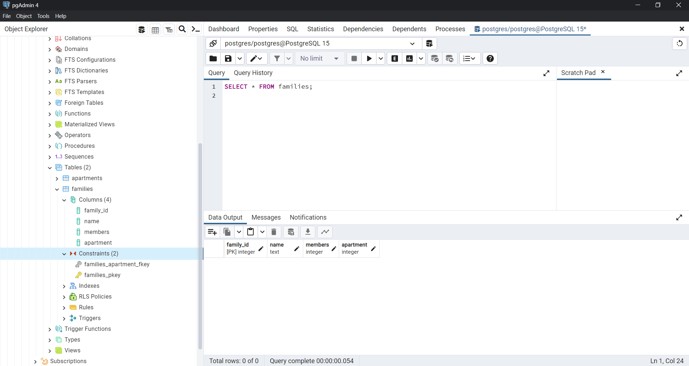

## Ejercicio 1
```sql
CREATE TABLE apartments(
	apartment_id SERIAL PRIMARY KEY,
	name TEXT,
	rooms INTEGER,
	bathrooms INTEGER,
	area NUMERIC
					   );
```

                       


```sql
CREATE TABLE families
(family_id SERIAL PRIMARY KEY,
 name TEXT,
 members INTEGER,
 apartment INTEGER,
 FOREIGN KEY(apartment) REFERENCES apartments(apartment_id)
);
```


                       